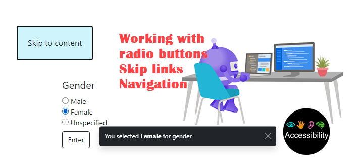

## Accessibility tips and tecniques

## Article 1

[Location](https://dev.to/karenpayneoregon/tips-on-making-a-web-site-accessible-part-1-5e8b)

- Skip links
- Navigation
- Working with radio buttons

## Article 2

Using the CSS reduce-motion query to prevent motion

## Requires

Microsoft Visual Studio 2022 or greater
